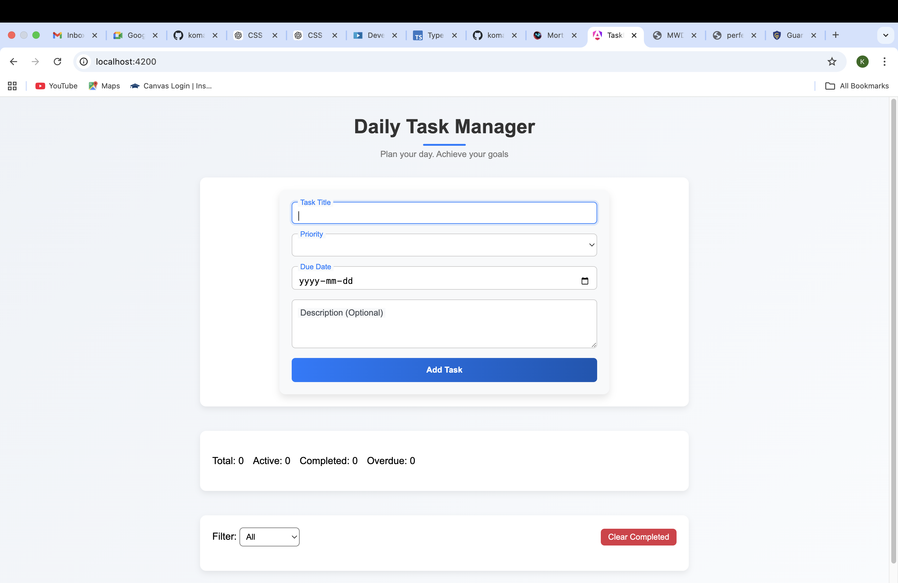
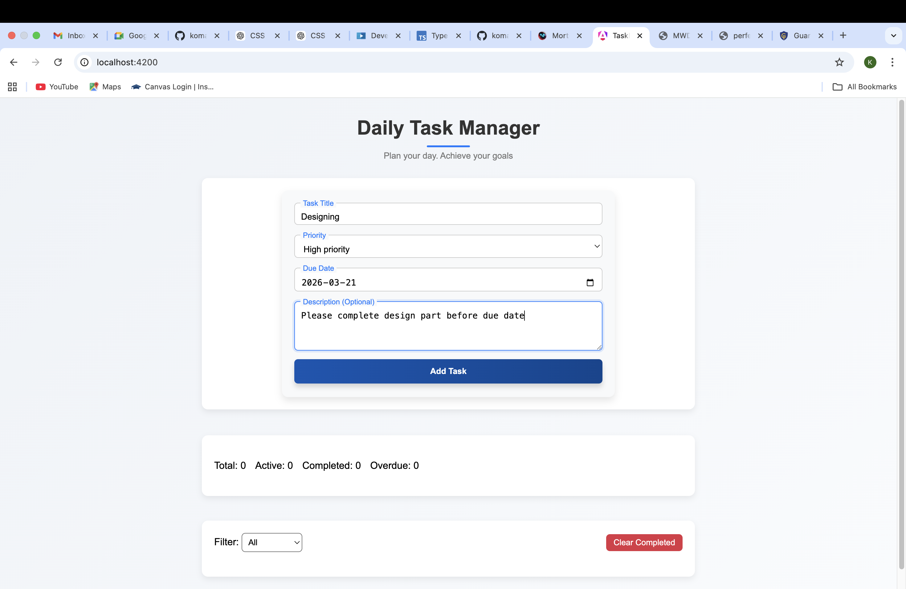
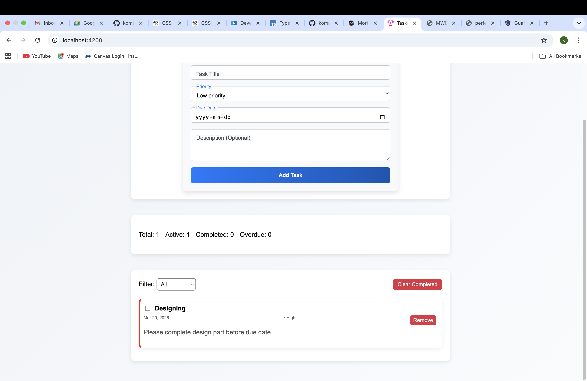
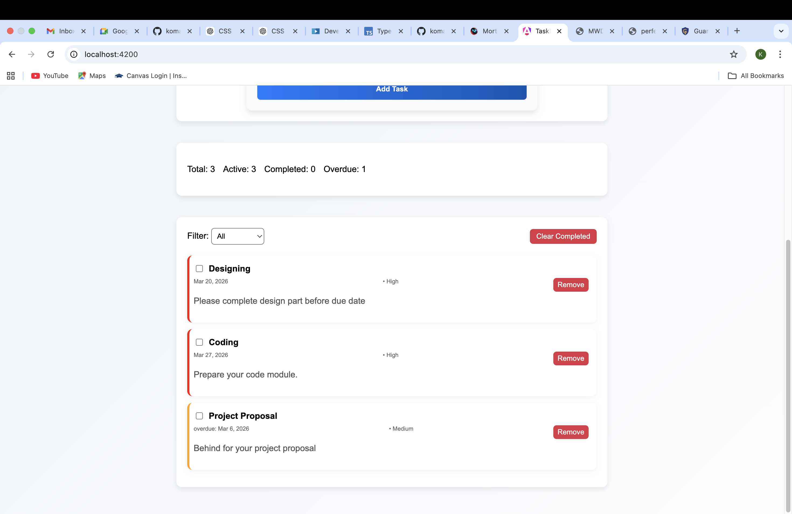
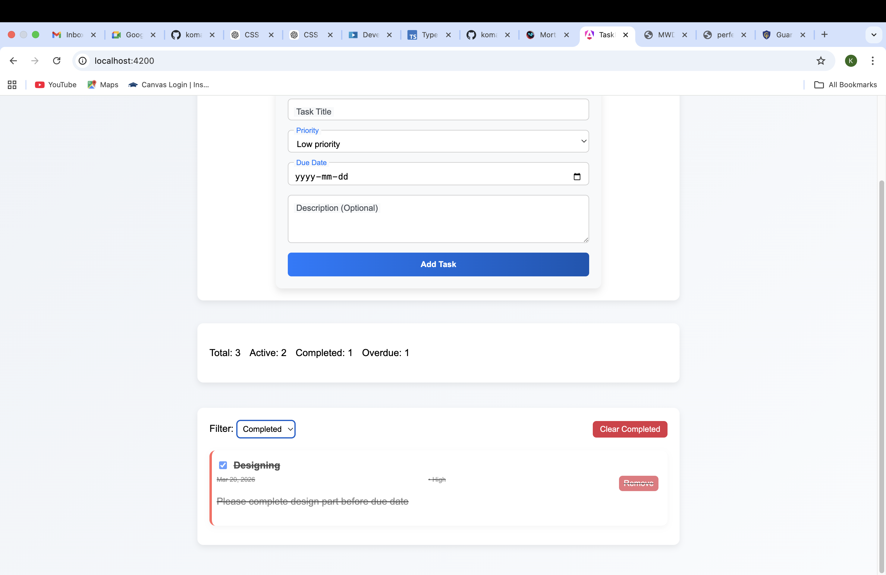
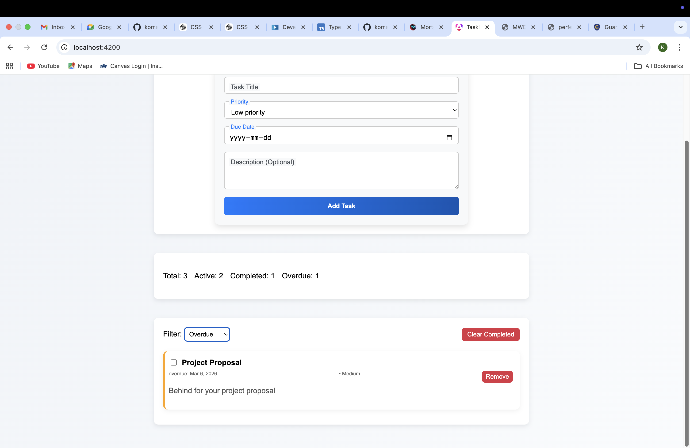
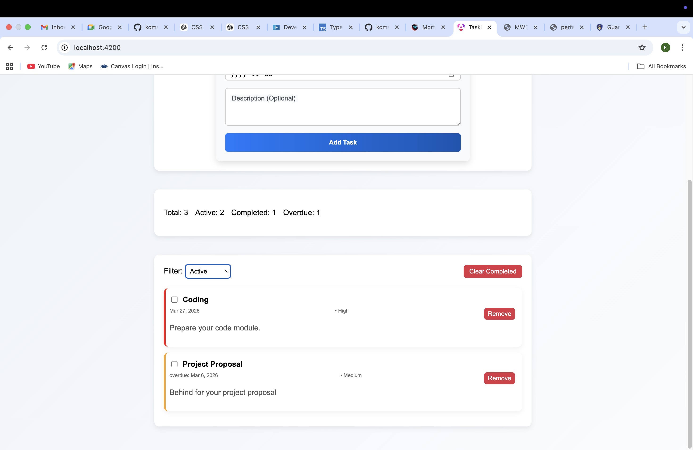
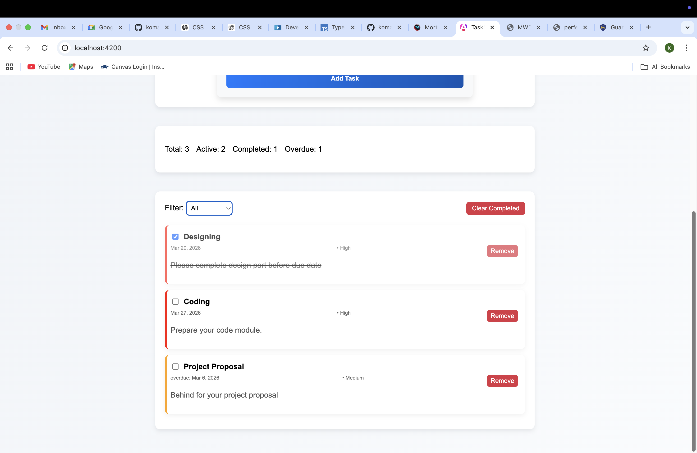

# TaskManager

This project was generated using [Angular CLI](https://github.com/angular/angular-cli) version 21.1.5.

## Development server

To start a local development server, run:

```bash
src/app/
├── components/
│   ├── task-form/
│   ├── task-list/
│   ├── task-item/
│   └── stats-panel/
├── directives/
│   └── task-status.directive.ts
├── pipes/
│   ├── due-date-label.pipe.ts
│   └── truncate.pipe.ts
├── services/
│   └── task.service.ts
├── models/
│   └── task.model.ts
├── app.html
├── app.scss
└── app.ts
Setup & Installation

Clone the repository

git clone https://github.com/yourusername/AngularApp2.git
cd AngularApp2

Install dependencies

npm install

Run the development server

ng serve

Open http://localhost:4200 in your browser to view the app.

Usage

Enter the task title, optional description, due date, and priority.

Click Add Task to create a new task.

Use filters to view tasks by status (all, active, completed, overdue).

Toggle task completion by clicking on the task, or remove a task using the delete button.

Stats Panel displays live task counts.

Components & Services
Component / Directive / Pipe	Description
TaskFormComponent	Handles task creation form
TaskListComponent	Displays list of tasks with filters
TaskItemComponent	Represents a single task item
StatsPanel	Shows task statistics
TaskStatusDirective	Styles tasks by completion & priority
DueDateLabelPipe	Formats due dates, labels overdue tasks
TruncatePipe	Truncates long task descriptions
TaskService	Manages task state using RxJS
Screenshots











